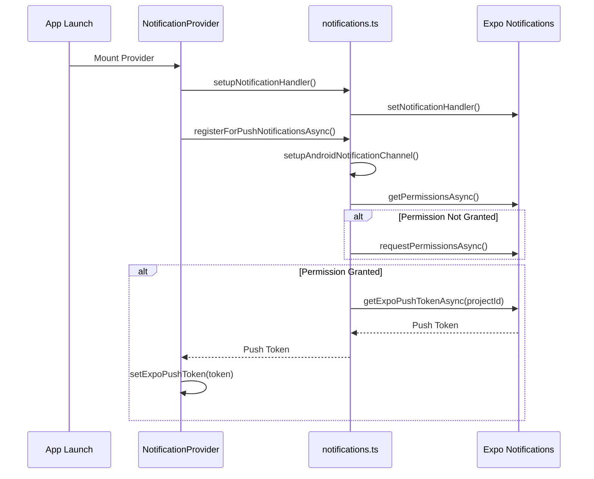

# Push Notification Setup Guide

This guide covers the complete push notification setup using Expo Notifications in a React Native (Expo) application.

## Overview

Push notifications in Sobers use Expo's push notification service, which provides a unified abstraction over native platforms (FCM for Android, APNs for iOS). The flow is:

1. App registers for push notifications and obtains an Expo Push Token
2. Token is stored/associated with the user
3. Backend/external service sends push notifications to the Expo Push API
4. Expo routes the notification to the appropriate platform (FCM/APNs)

**Platform Support:**

- **iOS**: Requires physical device (not simulator) and FCM configuration
- **Android**: Requires physical device (not emulator) and FCM configuration
- **Web**: Not supported for push notifications

## Prerequisites

- Expo project with EAS Build configured
- Access to [Firebase Console](https://console.firebase.google.com/)
- Access to [Expo Dashboard](https://expo.dev/)
- Physical device for testing

## Dependencies

```json
{
  "expo-notifications": "~0.32.15",
  "expo-device": "~8.0.10",
  "expo-constants": "~18.0.11"
}
```

Install with:

```bash
npx expo install expo-notifications expo-device expo-constants
```

---

## Part 1: FCM Credentials Setup (Required)

> [!IMPORTANT]
> Push notifications will not work without proper FCM credentials configuration. This is a mandatory step.

### Step 1: Create Firebase Project

1. Go to [Firebase Console](https://console.firebase.google.com/)
2. Click **Add project** (or select existing project)
3. Enter project name (e.g., `Sobers`)
4. Enable/disable Google Analytics as preferred
5. Click **Create project**

### Step 2: Add Android App to Firebase

1. In Firebase Console, click the **Android icon** to add an Android app
2. Enter the Android package name: `com.volvox.sobers`
3. Enter app nickname: `Sobers Android`
4. Click **Register app**
5. Download the `google-services.json` file
6. Place it in the project root (for EAS Build to pick up)

### Step 3: Add iOS App to Firebase

1. In Firebase Console, click **Add app** → **iOS**
2. Enter the iOS bundle ID: `com.volvox.sobrietywaypoint`
3. Enter app nickname: `Sobers iOS`
4. Click **Register app**
5. Download the `GoogleService-Info.plist` file
6. Place it in the project root

### Step 4: Get FCM Server Key

1. In Firebase Console, go to **Project settings** (gear icon)
2. Navigate to **Cloud Messaging** tab
3. If Cloud Messaging API (Legacy) is disabled:
   - Click the three dots menu
   - Click **Enable**
4. Copy the **Server key** (you'll need this for Expo)

### Step 5: Upload FCM Credentials to Expo

Run the following command to configure FCM:

```bash
eas credentials
```

Select:
1. **Android**
2. **production** (or your desired profile)
3. **Push Notifications: Manage your FCM Api Key**
4. **Add a new FCM API Key**
5. Paste the Server key from Step 4

For iOS, you'll need to configure APNs keys (handled automatically if using EAS Build with managed credentials).

### Video Tutorial

For a visual walkthrough of FCM setup, refer to: [YouTube Tutorial](https://www.youtube.com/watch?v=BCCjGtKtBjE)

### Official Documentation

For the most up-to-date instructions, see: [Expo FCM Credentials Guide](https://docs.expo.dev/push-notifications/fcm-credentials/)

---

## Part 2: Implementation

### File Structure

| File | Purpose |
|------|---------|
| `lib/notifications.ts` | Core notification utility functions |
| `contexts/NotificationContext.tsx` | React Context provider for notification state |
| `app/_layout.tsx` | Provider integration at app root |

---

### 1. Core Notification Library

**File**: `lib/notifications.ts`

```typescript
import Constants from 'expo-constants';
import * as Device from 'expo-device';
import * as Notifications from 'expo-notifications';
import { Platform } from 'react-native';

/**
 * Configures the default notification handler for the app
 * This determines how notifications are displayed when the app is in the foreground
 */
export function setupNotificationHandler() {
  Notifications.setNotificationHandler({
    handleNotification: async () => ({
      shouldPlaySound: true,
      shouldSetBadge: true,
      shouldShowBanner: true,
      shouldShowList: true,
    }),
  });
}

/**
 * Sets up the default notification channel for Android
 * Required for Android 8.0 (API level 26) and above
 */
async function setupAndroidNotificationChannel() {
  if (Platform.OS === 'android') {
    await Notifications.setNotificationChannelAsync('default', {
      name: 'default',
      importance: Notifications.AndroidImportance.MAX,
      vibrationPattern: [0, 250, 250, 250],
      lightColor: '#FF231F7C',
    });
  }
}

/**
 * Requests notification permissions and retrieves the Expo push token
 * Only works on physical devices
 * @returns The Expo push token or undefined if registration fails
 */
export async function registerForPushNotificationsAsync(): Promise<string | undefined> {
  console.log('registerForPushNotificationsAsync called');

  // Setup Android notification channel first
  await setupAndroidNotificationChannel();

  // Check if running on a physical device
  if (!Device.isDevice) {
    console.warn('Not a physical device');
    if (Platform.OS !== 'web') {
      console.log(
        'Push notifications only work on physical devices, not simulators/emulators'
      );
    }
    return;
  }

  try {
    // Check existing permission status
    const { status: existingStatus } =
      await Notifications.getPermissionsAsync();
    console.log(`Existing permission status: ${existingStatus}`);

    let finalStatus = existingStatus;

    // Request permission if not already granted
    if (existingStatus !== 'granted') {
      const { status } = await Notifications.requestPermissionsAsync();
      finalStatus = status;
      console.log(`Requested permission status: ${status}`);
    }

    // Check if permission was granted
    if (finalStatus !== 'granted') {
      console.warn('Permission not granted');
      throw new Error('Notification permission not granted');
    }

    // Get the Expo project ID from app.json
    const projectId =
      (Constants?.expoConfig?.extra?.eas as { projectId?: string })
        ?.projectId ??
      (Constants?.easConfig as { projectId?: string })?.projectId;

    if (!projectId) {
      console.error('Project ID not found in constants');
      throw new Error('Project ID not found. Please check your configuration.');
    }

    // Get the Expo push token
    const response = await Notifications.getExpoPushTokenAsync({ projectId });
    const token = response.data;
    console.log(`Expo Push Token: ${token}`);

    return token;
  } catch (error: unknown) {
    console.error(`Error getting push token: ${error}`);
    throw error;
  }
}

/**
 * Checks the current notification permission status
 * @returns The permission status and whether we can ask again
 */
export async function getNotificationPermissionStatus() {
  const { status, canAskAgain } = await Notifications.getPermissionsAsync();
  return { status, canAskAgain };
}
```

---

### 2. Notification Context Provider

**File**: `contexts/NotificationContext.tsx`

```typescript
import React, {
  createContext,
  ReactNode,
  useContext,
  useEffect,
  useState,
} from 'react';

import {
  registerForPushNotificationsAsync,
  setupNotificationHandler,
} from '@/lib/notifications';

interface NotificationContextType {
  expoPushToken: string | null;
  error: Error | null;
  isLoading: boolean;
}

const NotificationContext = createContext<NotificationContextType | undefined>(
  undefined
);

export const useNotification = () => {
  const context = useContext(NotificationContext);
  if (context === undefined) {
    throw new Error(
      'useNotification must be used within a NotificationProvider'
    );
  }
  return context;
};

interface NotificationProviderProps {
  children: ReactNode;
}

export const NotificationProvider: React.FC<NotificationProviderProps> = ({
  children,
}) => {
  const [expoPushToken, setExpoPushToken] = useState<string | null>(null);
  const [error, setError] = useState<Error | null>(null);
  const [isLoading, setIsLoading] = useState<boolean>(true);

  // Setup notification handler on mount
  useEffect(() => {
    setupNotificationHandler();
  }, []);

  // Register for push notifications on mount
  useEffect(() => {
    console.log('NotificationProvider mounted, requesting permissions...');

    registerForPushNotificationsAsync()
      .then(token => {
        setExpoPushToken(token ?? null);
        setIsLoading(false);
        if (token) {
          console.log('Push notification registration successful');
        }
      })
      .catch(err => {
        const errorObj =
          err instanceof Error ? err : new Error('Unknown error occurred');
        setError(errorObj);
        setIsLoading(false);
        console.error(`Push notification registration failed: ${err}`);
      });
  }, []);

  return (
    <NotificationContext.Provider value={{ expoPushToken, error, isLoading }}>
      {children}
    </NotificationContext.Provider>
  );
};
```

---

### 3. App Integration

**File**: `app/_layout.tsx`

Wrap your app with the `NotificationProvider`:

```typescript
import { NotificationProvider } from '@/contexts/NotificationContext';

export default function RootLayout() {
  return (
    <NotificationProvider>
      {/* Your app content */}
      <Slot />
    </NotificationProvider>
  );
}
```

---

## Part 3: Configuration

### app.json / app.config.ts

Add the Expo project ID for push token generation:

```json
{
  "expo": {
    "extra": {
      "eas": {
        "projectId": "your-project-id-here"
      }
    }
  }
}
```

> [!IMPORTANT]
> Get your project ID from the Expo dashboard or run `eas project:init` to generate one.

---

## Part 4: Flow Diagram



---

## Part 5: Usage

Access the push token anywhere in your app:

```typescript
import { useNotification } from '@/contexts/NotificationContext';

function MyComponent() {
  const { expoPushToken, isLoading, error } = useNotification();

  if (isLoading) {
    return <Text>Loading...</Text>;
  }

  if (error) {
    return <Text>Error: {error.message}</Text>;
  }

  return <Text>Token: {expoPushToken}</Text>;
}
```

---

## Part 6: Testing Notifications

### Test Tool

Use Expo's official notification testing tool:

**[https://expo.dev/notifications](https://expo.dev/notifications)**

1. Copy your Expo Push Token from the console logs
2. Navigate to the testing tool
3. Paste your token
4. Fill in title and body
5. Click **Send a Notification**

### Testing via cURL

Send test notifications directly via cURL:

```bash
curl -H "Content-Type: application/json" -X POST "https://exp.host/--/api/v2/push/send" -d '{
  "to": "ExponentPushToken[xxxxxxxxxxxxxxxxxxxxxx]",
  "title": "Hello",
  "body": "World",
  "richContent": {"image": "https://example.com/image.png"}
}'
```

**Parameters:**

| Parameter | Description |
|-----------|-------------|
| `to` | The Expo Push Token (required) |
| `title` | Notification title |
| `body` | Notification body |
| `data` | Custom data payload (JSON object) |
| `sound` | Sound to play (`default` or custom) |
| `badge` | Badge count (iOS only) |
| `richContent.image` | Image URL for rich notifications |

### Sending Notifications from Backend

For production use, send notifications from your backend. Refer to the official documentation:

**[Expo Sending Notifications Guide](https://docs.expo.dev/push-notifications/sending-notifications/)**

---

## Part 7: Key Points

| Feature | Description |
|---------|-------------|
| **Physical Device Only** | Push notifications only work on physical devices, not simulators |
| **Android Channels** | Automatically configures notification channels for Android 8.0+ |
| **Foreground Display** | Notifications show even when app is in foreground |
| **Permission Handling** | Automatically requests permissions on app launch |

---

## Part 8: Troubleshooting

| Issue | Solution |
|-------|----------|
| Token not received | Ensure running on physical device, not simulator |
| Project ID not found | Add `projectId` in `app.json` under `extra.eas` |
| Permission denied | User must manually enable in device settings |
| Android notifications not showing | Verify notification channel is created |
| FCM errors | Verify FCM credentials are uploaded to Expo via `eas credentials` |

### Resetting Notification Permissions

**iOS:**
1. Go to **Settings** → **Notifications** → **Sobers**
2. Toggle notifications off and then on

**Android:**
1. Go to **Settings** → **Apps** → **Sobers** → **Notifications**
2. Ensure notifications are enabled

---

## Related Files

- `lib/notifications.ts` - Core notification utility functions
- `contexts/NotificationContext.tsx` - Notification context provider
- `app/_layout.tsx` - App entry point with provider integration
- `app.config.ts` - Expo configuration with project ID

## References

- [Expo Notifications Documentation](https://docs.expo.dev/push-notifications/overview/)
- [Expo FCM Credentials Setup](https://docs.expo.dev/push-notifications/fcm-credentials/)
- [Expo Sending Notifications](https://docs.expo.dev/push-notifications/sending-notifications/)
- [Expo Notification Testing Tool](https://expo.dev/notifications)
- [FCM Setup Video Tutorial](https://www.youtube.com/watch?v=BCCjGtKtBjE)
